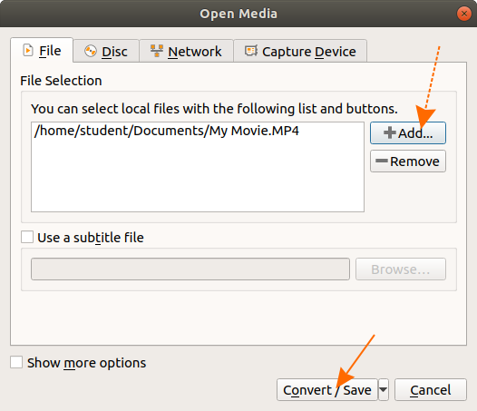

# Compressing MP4 with VLC

This is a brief description of how to convert a large MP4 file to a smaller size. This is suitable for data transfer, especially to upload to social media networks. The conversion will be done with the VLC media player.

* Download VLC from https://www.videolan.org/vlc/download-windows.html
* Open VLC through this icon: 
* Click on "Media" and click "convert" as shown below: 
 
* Click the "Add" button to choose the mp4 file to convert  

* Click the "Convert" button
* The below window will appear. Please do the following
    ** Select "Video for Youtube HD" as shown in (1) in the below screenshot
    ** select the name of the compression mp4 as shown in (2) in the below screenshot.

* Click the "start" button
* the video conversion will start. The compressed files will be saved in the location defined in the previous 2 steps. The conversion will complete once the timing progress will reach the total playing time. That is, when the left most arrow arrives at the right most arrow in the below screenshot:
